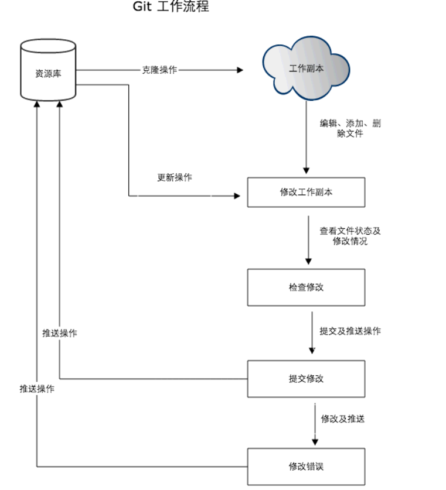
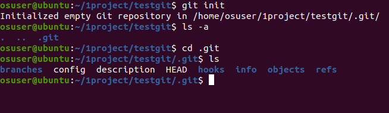

# git使用

## 1.git的安装

使用库安装

sudo apt update

sudo apt-get  install git

测试：git --version

## 2.git工作流程

我们先来理解下 Git 工作区、暂存区和版本库概念：

- **工作区：**就是你在电脑里能看到的目录。
- **暂存区：**英文叫 stage 或 index。一般存放在 **.git** 目录下的 index 文件（.git/index）中，所以我们把暂存区有时也叫作索引（index）。
- **版本库：**工作区有一个隐藏目录 **.git**，这个不算工作区，而是 Git 的版本库。

下面这个图展示了工作区、版本库中的暂存区和版本库之间的关系：

## 3.git常用命令

1）git项目创建

新建目录，在此目录下执行：git init 执行后创建一个隐藏的.git目录：

